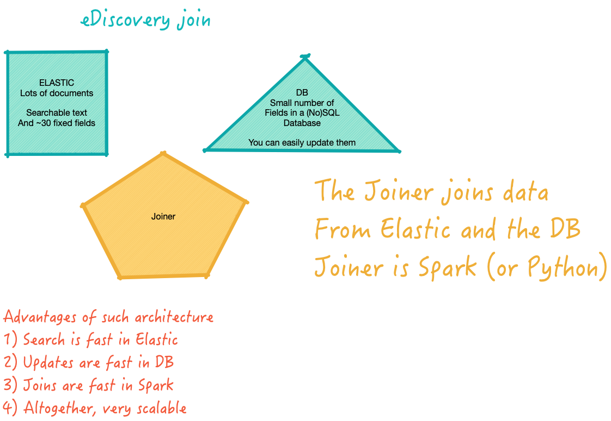

# Processing ideas

## eDiscovery join

* It can be done as describe in this diagram

* A way to test it is
  - set up a realistic size Elastic
  - set up a realistic size database
  - try various joins
  - measure performance of the joiner
  - we can experiment with different joiners
     - Spark
     - Python on a single node
     - Google Dataproc